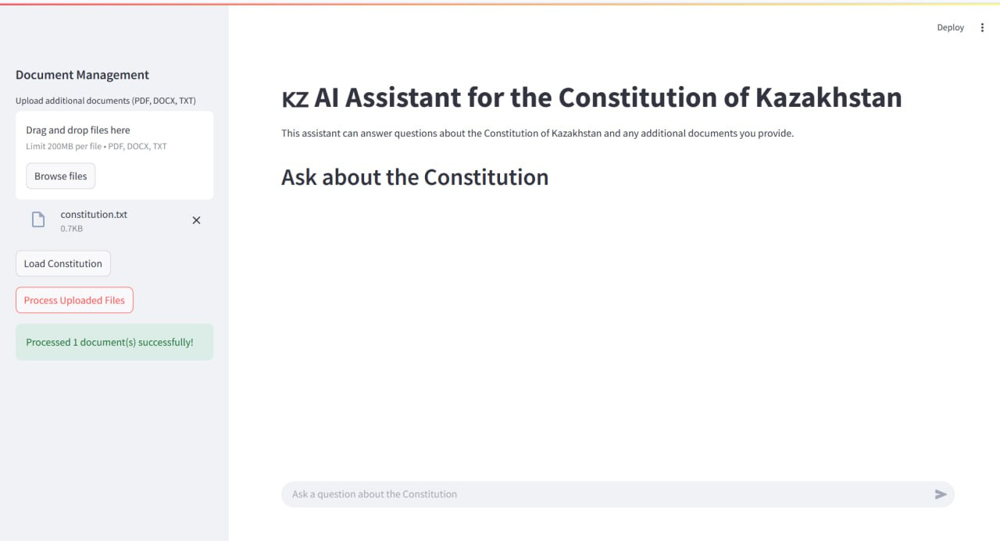
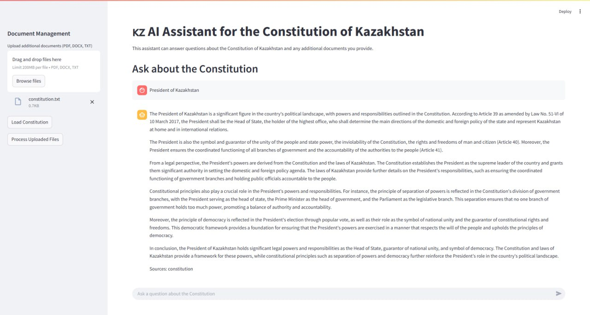
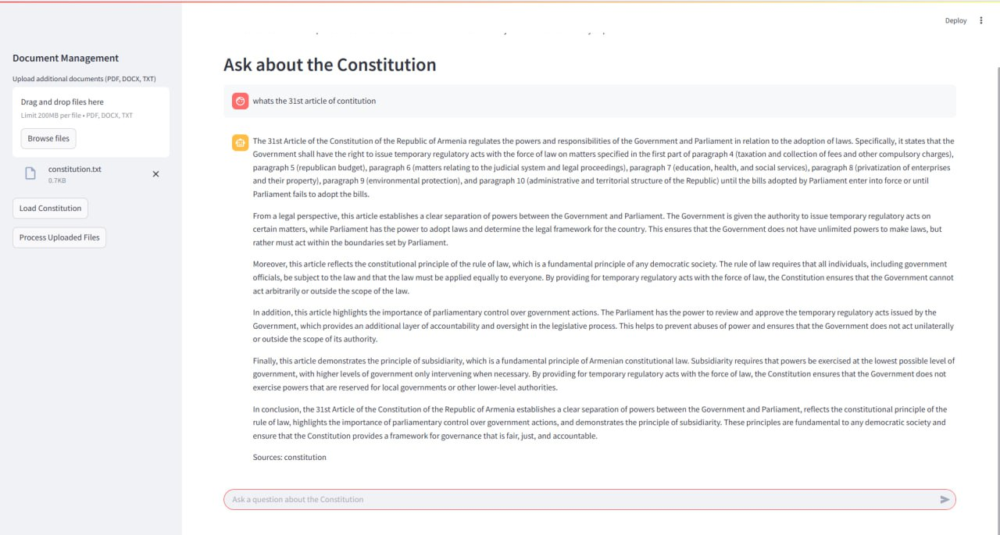

# Kazakhstan Constitution AI Assistant 📜





An AI-powered assistant for querying the Constitution of Kazakhstan and related legal documents, built with Streamlit and LangChain.

## Features ✨

- **Constitution Analysis**: Load and query the official Constitution of Kazakhstan directly from the government website
- **Document Upload**: Support for PDF, TXT, and DOCX files to expand the knowledge base
- **AI-Powered Q&A**: Get accurate answers to legal questions using OpenAI's GPT-4 model
- **Source Tracking**: Option to view document sources for each answer (when enabled)
- **Persistent Memory**: Maintains conversation history during the session

## Installation 🛠️

1. Clone the repository:
   ```bash
   git clone https://github.com/estelif/assik3.git
   cd constitution_assistant
